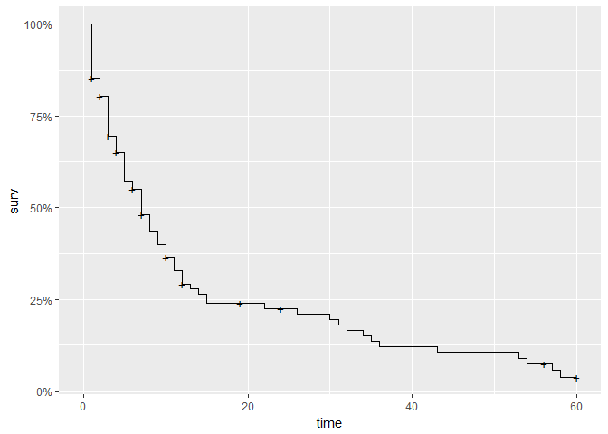
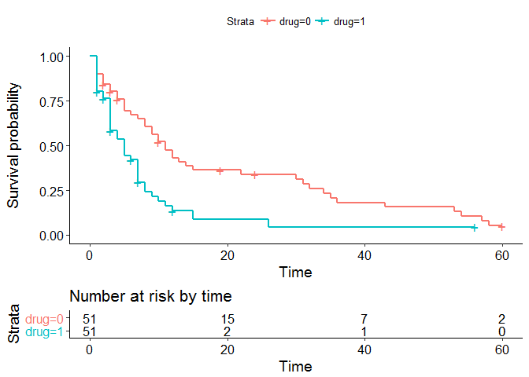
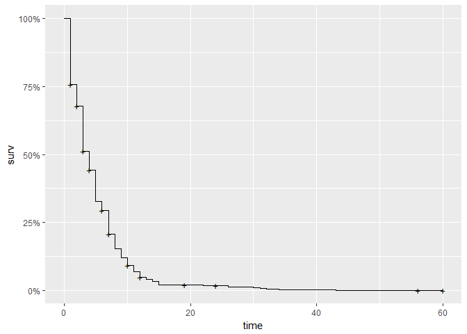
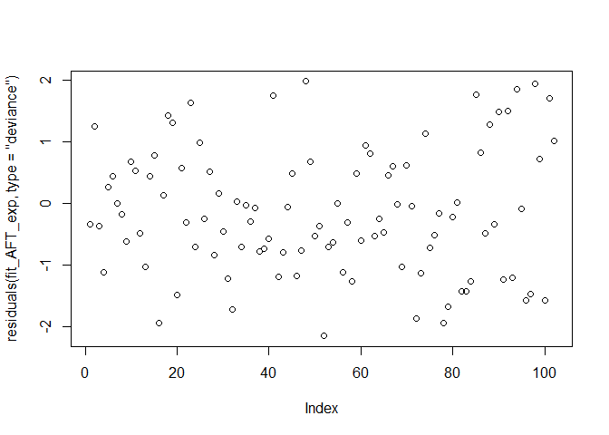
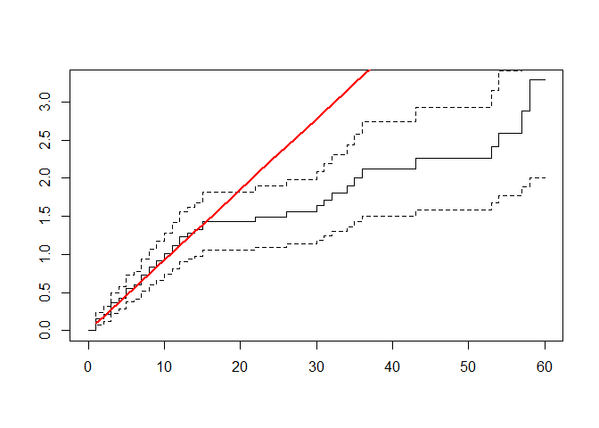
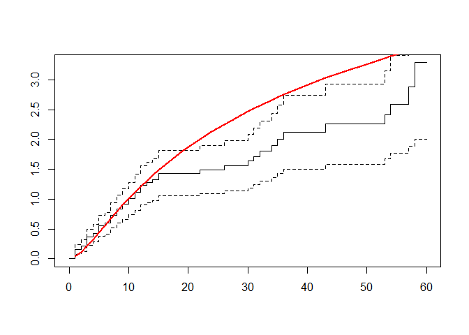

SPPH 581c - Assignment 4
================
Patrick Daniele
February 20, 2017

<p>
I'm going to complete this as an R-Markdown document as some of the packages I use require R-Studio and a very up to date version of R.
</p>
<p>
Load Libraries
</p>
``` r
library(survival)
library(tidyverse)
```

    ## Loading tidyverse: ggplot2
    ## Loading tidyverse: tibble
    ## Loading tidyverse: tidyr
    ## Loading tidyverse: readr
    ## Loading tidyverse: purrr
    ## Loading tidyverse: dplyr

    ## Conflicts with tidy packages ----------------------------------------------

    ## filter(): dplyr, stats
    ## lag():    dplyr, stats

``` r
library(survminer)
library(ggfortify)
library(flexsurv)
```

<p>
Incase you haven't seen it before, the "tidyverse" is a set of packages that makes using R much better (In my opinion).
</p>
<p>
Import the data and basic tidying
</p>
``` r
temp <- read.csv('C:/Users/pdaniele/Desktop/SPPH 581c/Assignment 4/alzheimers.csv', header=T)
str(temp)
```

    ## 'data.frame':    102 obs. of  7 variables:
    ##  $ ID     : int  1 2 3 4 5 6 7 8 9 10 ...
    ##  $ time   : int  5 6 8 3 22 1 7 9 3 12 ...
    ##  $ age    : int  46 35 30 30 36 32 36 31 48 47 ...
    ##  $ drug   : int  0 1 1 1 0 1 1 1 0 0 ...
    ##  $ censor : int  1 0 1 1 1 0 1 1 1 1 ...
    ##  $ entdate: Factor w/ 96 levels "1/13/1989","1/17/1989",..: 57 94 46 5 93 34 13 17 30 78 ...
    ##  $ enddate: Factor w/ 94 levels "1/10/1992","1/13/1990",..: 14 46 33 57 78 53 72 85 63 84 ...

``` r
#Note to self, dates are factors. I don't think we need them, so I won't do anything about them now.

#Change drug to a factor
temp2 <- temp %>% 
  mutate(drug=factor(drug))

# Change it to a tibble for easier processing
data <- as_data_frame(temp2)
data
```

    ## # A tibble: 102 × 7
    ##       ID  time   age   drug censor    entdate    enddate
    ##    <int> <int> <int> <fctr>  <int>     <fctr>     <fctr>
    ## 1      1     5    46      0      1  5/15/1990 10/14/1990
    ## 2      2     6    35      1      0  9/19/1989  3/20/1990
    ## 3      3     8    30      1      1  4/21/1991 12/20/1991
    ## 4      4     3    30      1      1   1/3/1991   4/4/1991
    ## 5      5    22    36      0      1  9/18/1989  7/19/1991
    ## 6      6     1    32      1      0  3/18/1991  4/17/1991
    ## 7      7     7    36      1      1 11/11/1989  6/11/1990
    ## 8      8     9    31      1      1 11/25/1989  8/25/1990
    ## 9      9     3    48      0      1  2/11/1991  5/13/1991
    ## 10    10    12    47      0      1  8/11/1989  8/11/1990
    ## # ... with 92 more rows

<p>
Basic data exploration
</p>
``` r
## Checking normality of Age.
hist(data$age)
```


``` r
## Looks good to me

#Checking how many had events
table(data$censor)
```

    ## 
    ##  0  1 
    ## 20 82

``` r
## Checking How many on each drug
table(data$drug)
```

    ## 
    ##  0  1 
    ## 51 51

``` r
## Balanced!

## Check the association between time and censor, and age as per Jason's recommendation
fit1 <- lm(time ~ age, data=data)
summary(fit1)
```

    ## 
    ## Call:
    ## lm(formula = time ~ age, data = data)
    ## 
    ## Residuals:
    ##     Min      1Q  Median      3Q     Max 
    ## -21.201  -7.884  -3.979   4.040  45.376 
    ## 
    ## Coefficients:
    ##             Estimate Std. Error t value Pr(>|t|)    
    ## (Intercept)  49.7032     7.3537   6.759 9.40e-10 ***
    ## age          -1.0578     0.2003  -5.282 7.48e-07 ***
    ## ---
    ## Signif. codes:  0 '***' 0.001 '**' 0.01 '*' 0.05 '.' 0.1 ' ' 1
    ## 
    ## Residual standard error: 13.51 on 100 degrees of freedom
    ## Multiple R-squared:  0.2181, Adjusted R-squared:  0.2103 
    ## F-statistic:  27.9 on 1 and 100 DF,  p-value: 7.484e-07

``` r
## Pretty strong negative association. Makes sense as older people would die younger.
fit2 <- glm(censor~age, data=data)
summary(fit2)
```

    ## 
    ## Call:
    ## glm(formula = censor ~ age, data = data)
    ## 
    ## Deviance Residuals: 
    ##     Min       1Q   Median       3Q      Max  
    ## -0.8673   0.1263   0.1840   0.2160   0.2929  
    ## 
    ## Coefficients:
    ##             Estimate Std. Error t value Pr(>|t|)   
    ## (Intercept) 0.572529   0.217017   2.638  0.00967 **
    ## age         0.006408   0.005910   1.084  0.28083   
    ## ---
    ## Signif. codes:  0 '***' 0.001 '**' 0.01 '*' 0.05 '.' 0.1 ' ' 1
    ## 
    ## (Dispersion parameter for gaussian family taken to be 0.1589158)
    ## 
    ##     Null deviance: 16.078  on 101  degrees of freedom
    ## Residual deviance: 15.892  on 100  degrees of freedom
    ## AIC: 105.83
    ## 
    ## Number of Fisher Scoring iterations: 2

``` r
## Not sig. Good! Wouldn't want to see any differences in people who are censored. 
## This helps to validate our assumption of non-informative censoring.
fit3 <- glm(censor~drug, data=data)
summary(fit3)
```

    ## 
    ## Call:
    ## glm(formula = censor ~ drug, data = data)
    ## 
    ## Deviance Residuals: 
    ##     Min       1Q   Median       3Q      Max  
    ## -0.8235   0.1765   0.1765   0.2157   0.2157  
    ## 
    ## Coefficients:
    ##             Estimate Std. Error t value Pr(>|t|)    
    ## (Intercept)  0.82353    0.05608  14.685   <2e-16 ***
    ## drug1       -0.03922    0.07931  -0.494    0.622    
    ## ---
    ## Signif. codes:  0 '***' 0.001 '**' 0.01 '*' 0.05 '.' 0.1 ' ' 1
    ## 
    ## (Dispersion parameter for gaussian family taken to be 0.1603922)
    ## 
    ##     Null deviance: 16.078  on 101  degrees of freedom
    ## Residual deviance: 16.039  on 100  degrees of freedom
    ## AIC: 106.77
    ## 
    ## Number of Fisher Scoring iterations: 2

``` r
## Same for Drug.
```

<p>
Three majors sections:
</p>
<ol>
<li>
Non-Parametric: Kaplan Meier Estimates
</li>
<li>
Semi-Parametric: Cox Proportional Hazards Model
</li>
<li>
Fully Parametric: Weibull, Exponential, Log-Normal, Log-Logistic
</li>
</ol>
<h1>
Non-Parametric
</h1>
``` r
## Overall
fit_KM <- survfit(Surv(time, censor) ~ 1, data)

fit_KM %>% 
  summary()
```

    ## Call: survfit(formula = Surv(time, censor) ~ 1, data = data)
    ## 
    ##  time n.risk n.event survival std.err lower 95% CI upper 95% CI
    ##     1    102      15   0.8529  0.0351       0.7869        0.925
    ##     2     85       5   0.8028  0.0395       0.7289        0.884
    ##     3     75      10   0.6957  0.0466       0.6102        0.793
    ##     4     63       4   0.6516  0.0486       0.5630        0.754
    ##     5     58       7   0.5729  0.0510       0.4812        0.682
    ##     6     51       2   0.5505  0.0514       0.4584        0.661
    ##     7     48       6   0.4816  0.0521       0.3896        0.595
    ##     8     41       4   0.4347  0.0520       0.3437        0.550
    ##     9     37       3   0.3994  0.0516       0.3100        0.515
    ##    10     34       3   0.3642  0.0509       0.2769        0.479
    ##    11     30       3   0.3278  0.0500       0.2431        0.442
    ##    12     27       3   0.2913  0.0487       0.2100        0.404
    ##    13     22       1   0.2781  0.0482       0.1980        0.391
    ##    14     21       1   0.2649  0.0477       0.1861        0.377
    ##    15     20       2   0.2384  0.0465       0.1627        0.349
    ##    22     17       1   0.2243  0.0458       0.1504        0.335
    ##    26     15       1   0.2094  0.0451       0.1373        0.319
    ##    30     14       1   0.1944  0.0443       0.1244        0.304
    ##    31     13       1   0.1795  0.0434       0.1118        0.288
    ##    32     12       1   0.1645  0.0422       0.0995        0.272
    ##    34     11       1   0.1496  0.0410       0.0874        0.256
    ##    35     10       1   0.1346  0.0395       0.0757        0.239
    ##    36      9       1   0.1197  0.0378       0.0644        0.222
    ##    43      8       1   0.1047  0.0359       0.0534        0.205
    ##    53      7       1   0.0897  0.0338       0.0429        0.188
    ##    54      6       1   0.0748  0.0313       0.0329        0.170
    ##    57      4       1   0.0561  0.0285       0.0207        0.152
    ##    58      3       1   0.0374  0.0244       0.0104        0.134

``` r
## Try different survival plot methods
#Extensions of GGPlot2

fit_KM %>% 
  ggsurvplot(risk.table = TRUE, ggtheme=theme_classic())
```


``` r
fit_KM %>% 
  autoplot(conf.int=F)
```



``` r
## By Drug
fit_KM_drug <- survfit(Surv(time, censor) ~ drug, data)

fit_KM_drug %>% 
  summary()
```

    ## Call: survfit(formula = Surv(time, censor) ~ drug, data = data)
    ## 
    ##                 drug=0 
    ##  time n.risk n.event survival std.err lower 95% CI upper 95% CI
    ##     1     51       5   0.9020  0.0416       0.8239        0.987
    ##     2     46       3   0.8431  0.0509       0.7490        0.949
    ##     3     41       2   0.8020  0.0561       0.6992        0.920
    ##     4     38       2   0.7598  0.0606       0.6498        0.888
    ##     5     35       3   0.6947  0.0660       0.5766        0.837
    ##     6     32       1   0.6730  0.0675       0.5529        0.819
    ##     7     31       1   0.6513  0.0687       0.5296        0.801
    ##     8     30       2   0.6078  0.0706       0.4840        0.763
    ##     9     28       2   0.5644  0.0720       0.4396        0.725
    ##    10     26       2   0.5210  0.0727       0.3964        0.685
    ##    11     23       2   0.4757  0.0731       0.3520        0.643
    ##    12     21       2   0.4304  0.0728       0.3090        0.600
    ##    13     19       1   0.4077  0.0724       0.2879        0.577
    ##    14     18       1   0.3851  0.0718       0.2672        0.555
    ##    15     17       1   0.3624  0.0711       0.2468        0.532
    ##    22     15       1   0.3383  0.0703       0.2250        0.508
    ##    30     13       1   0.3123  0.0696       0.2018        0.483
    ##    31     12       1   0.2862  0.0685       0.1791        0.457
    ##    32     11       1   0.2602  0.0670       0.1571        0.431
    ##    34     10       1   0.2342  0.0652       0.1357        0.404
    ##    35      9       1   0.2082  0.0629       0.1151        0.376
    ##    36      8       1   0.1821  0.0602       0.0953        0.348
    ##    43      7       1   0.1561  0.0569       0.0764        0.319
    ##    53      6       1   0.1301  0.0531       0.0585        0.289
    ##    54      5       1   0.1041  0.0484       0.0418        0.259
    ##    57      4       1   0.0781  0.0427       0.0267        0.228
    ##    58      3       1   0.0520  0.0355       0.0136        0.198
    ## 
    ##                 drug=1 
    ##  time n.risk n.event survival std.err lower 95% CI upper 95% CI
    ##     1     51      10   0.8039  0.0556      0.70202        0.921
    ##     2     39       2   0.7627  0.0599      0.65388        0.890
    ##     3     34       8   0.5832  0.0719      0.45797        0.743
    ##     4     25       2   0.5366  0.0734      0.41043        0.701
    ##     5     23       4   0.4433  0.0740      0.31960        0.615
    ##     6     19       1   0.4199  0.0737      0.29775        0.592
    ##     7     17       5   0.2964  0.0697      0.18697        0.470
    ##     8     11       2   0.2425  0.0666      0.14155        0.416
    ##     9      9       1   0.2156  0.0644      0.11999        0.387
    ##    10      8       1   0.1886  0.0618      0.09928        0.358
    ##    11      7       1   0.1617  0.0585      0.07953        0.329
    ##    12      6       1   0.1347  0.0546      0.06087        0.298
    ##    15      3       1   0.0898  0.0517      0.02908        0.277
    ##    26      2       1   0.0449  0.0409      0.00752        0.268

``` r
survdiff(Surv(time, censor) ~ drug, data)
```

    ## Call:
    ## survdiff(formula = Surv(time, censor) ~ drug, data = data)
    ## 
    ##         N Observed Expected (O-E)^2/E (O-E)^2/V
    ## drug=0 51       42     54.8      2.98      10.9
    ## drug=1 51       40     27.2      5.98      10.9
    ## 
    ##  Chisq= 10.9  on 1 degrees of freedom, p= 0.000971

``` r
## Try different survival plot methods
fit_KM_drug %>% 
  autoplot(conf.int=F)
```


``` r
fit_KM_drug %>% 
  ggsurvplot(risk.table = TRUE, ggtheme=theme_classic())
```



``` r
## Let's get both the by drug and overall on the same plot
plot(fit_KM, conf.int=F, xlab='Time (Months)', ylab='Survival', lwd=2)
lines(fit_KM_drug, lty=c(2,2), lwd=c(2,2), col=c("#8E8E8E","#5CB2C8"))
legend('topright', c('Drug 0', 'Drug 1'), lwd=2, lty=2, col=c("#8E8E8E","#5CB2C8"))
text(40, 1, 'Log-rank p=0.000971')
```


``` r
## Side by Side KM Plots
plot(fit_KM_drug, conf.int=T, xlab='Time (Months)', ylab='Survival', lwd=2, col=c("#8E8E8E","#5CB2C8"))
legend('topright', c('Drug 0', 'Drug 1'), lwd=2, lty=2, col=c("#8E8E8E","#5CB2C8"))
```


<p>
This is completely descriptive, so I think I would always do this regardless of what modeling technique I chose in the end
</p>
<h1>
Semi-Parametric
</h1>
``` r
## Without Age
coxfit1 <- coxph(Surv(time, censor) ~ drug, data)
coxfit1 %>% 
  summary()
```

    ## Call:
    ## coxph(formula = Surv(time, censor) ~ drug, data = data)
    ## 
    ##   n= 102, number of events= 82 
    ## 
    ##         coef exp(coef) se(coef)     z Pr(>|z|)   
    ## drug1 0.7766    2.1741   0.2365 3.284  0.00102 **
    ## ---
    ## Signif. codes:  0 '***' 0.001 '**' 0.01 '*' 0.05 '.' 0.1 ' ' 1
    ## 
    ##       exp(coef) exp(-coef) lower .95 upper .95
    ## drug1     2.174       0.46     1.368     3.456
    ## 
    ## Concordance= 0.603  (se = 0.035 )
    ## Rsquare= 0.099   (max possible= 0.997 )
    ## Likelihood ratio test= 10.66  on 1 df,   p=0.001097
    ## Wald test            = 10.78  on 1 df,   p=0.001025
    ## Score (logrank) test = 11.21  on 1 df,   p=0.0008131

``` r
## With Age
coxfit2 <- coxph(Surv(time, censor) ~ drug + age, data)
coxfit2 %>% 
  summary()
```

    ## Call:
    ## coxph(formula = Surv(time, censor) ~ drug + age, data = data)
    ## 
    ##   n= 102, number of events= 82 
    ## 
    ##          coef exp(coef) se(coef)     z Pr(>|z|)    
    ## drug1 0.86223   2.36844  0.24418 3.531 0.000414 ***
    ## age   0.08749   1.09143  0.01760 4.971 6.66e-07 ***
    ## ---
    ## Signif. codes:  0 '***' 0.001 '**' 0.01 '*' 0.05 '.' 0.1 ' ' 1
    ## 
    ##       exp(coef) exp(-coef) lower .95 upper .95
    ## drug1     2.368     0.4222     1.468     3.822
    ## age       1.091     0.9162     1.054     1.130
    ## 
    ## Concordance= 0.699  (se = 0.042 )
    ## Rsquare= 0.293   (max possible= 0.997 )
    ## Likelihood ratio test= 35.3  on 2 df,   p=2.164e-08
    ## Wald test            = 34.09  on 2 df,   p=3.965e-08
    ## Score (logrank) test = 35.52  on 2 df,   p=1.938e-08

``` r
## Check model Fit and Assumptions (PH)
coxfit1 %>% 
    AIC()
```

    ## [1] 600.3902

``` r
coxfit1 %>% 
  cox.zph() %>% 
  plot()
```


``` r
coxfit2 %>% 
    AIC()
```

    ## [1] 577.7488

``` r
coxfit2 %>% 
  cox.zph() %>% 
  plot()
```


``` r
plot(residuals(coxfit2, type='martingale'))
```


``` r
plot(residuals(coxfit2, type='schoenfeld'))
```


``` r
#Plotting the Cumulative Hazard
cumhaz.plot <- survfit(Surv(time, censor) ~ drug, data, type='fleming') 

plot(cumhaz.plot, lty=2:3, fun='cumhaz', xlab='Time (Months)', ylab='Cumulative Hazard')
```


``` r
## Global test looks good. Plots look OK to me. 
## Residuals look good.
## Age improves fit.

## Plotting survival for the drug=1 group.
autoplot(survfit(coxfit1, newdata=data.frame(drug=1)), conf.int=F)
```

    ## Warning in model.frame.default(Terms2, data = newdata, na.action =
    ## na.action, : variable 'drug' is not a factor


``` r
##Survival for Age = 50
autoplot(survfit(coxfit2, newdata=data.frame(drug=0, age=50)), conf.int=F)
```

    ## Warning in model.frame.default(Terms2, data = newdata, na.action =
    ## na.action, : variable 'drug' is not a factor



``` r
autoplot(survfit(coxfit2, newdata=data.frame(drug=1, age=50)), conf.int=F)
```

    ## Warning in model.frame.default(Terms2, data = newdata, na.action =
    ## na.action, : variable 'drug' is not a factor


<p>
Assumptions look good, fit is reasonable. I'll compare it to the parametric curves at the end
</p>
<h1>
Fully-Parametric
</h1>
``` r
#Exponential Distribution
fit_AFT_exp <- survreg(Surv(time, censor) ~ drug + age, data, dist='exponential')
fit_AFT_exp %>% 
  summary()
```

    ## 
    ## Call:
    ## survreg(formula = Surv(time, censor) ~ drug + age, data = data, 
    ##     dist = "exponential")
    ##               Value Std. Error     z        p
    ## (Intercept)  5.9983     0.5910 10.15 3.35e-24
    ## drug1       -0.8945     0.2214 -4.04 5.35e-05
    ## age         -0.0878     0.0158 -5.54 2.95e-08
    ## 
    ## Scale fixed at 1 
    ## 
    ## Exponential distribution
    ## Loglik(model)= -275.4   Loglik(intercept only)= -300.2
    ##  Chisq= 49.64 on 2 degrees of freedom, p= 1.7e-11 
    ## Number of Newton-Raphson Iterations: 4 
    ## n= 102

``` r
plot(residuals(fit_AFT_exp, type="deviance"))
```



``` r
fit_AFT_exp %>% 
    AIC()
```

    ## [1] 556.8394

``` r
#Weibull Distribution
fit_AFT_W <- survreg(Surv(time, censor) ~ drug + age, data, dist='weibull')
fit_AFT_W %>% 
  summary()
```

    ## 
    ## Call:
    ## survreg(formula = Surv(time, censor) ~ drug + age, data = data, 
    ##     dist = "weibull")
    ##               Value Std. Error     z        p
    ## (Intercept)  5.9745     0.5161 11.58 5.49e-31
    ## drug1       -0.9135     0.1938 -4.71 2.44e-06
    ## age         -0.0863     0.0139 -6.22 4.85e-10
    ## Log(scale)  -0.1348     0.0837 -1.61 1.07e-01
    ## 
    ## Scale= 0.874 
    ## 
    ## Weibull distribution
    ## Loglik(model)= -274.2   Loglik(intercept only)= -297.8
    ##  Chisq= 47.22 on 2 degrees of freedom, p= 5.6e-11 
    ## Number of Newton-Raphson Iterations: 5 
    ## n= 102

``` r
fit_AFT_W %>% 
    AIC()
```

    ## [1] 556.4227

``` r
plot(residuals(fit_AFT_W, type="deviance"))
```


``` r
#Lognormal
fit_AFT_lognorm <- survreg(Surv(time, censor) ~ drug + age, data, dist='lognormal')
fit_AFT_lognorm %>% 
  summary()
```

    ## 
    ## Call:
    ## survreg(formula = Surv(time, censor) ~ drug + age, data = data, 
    ##     dist = "lognormal")
    ##               Value Std. Error      z        p
    ## (Intercept)  5.3276     0.6017  8.854 8.47e-19
    ## drug1       -0.8005     0.2176 -3.679 2.34e-04
    ## age         -0.0828     0.0162 -5.116 3.11e-07
    ## Log(scale)   0.0477     0.0784  0.609 5.43e-01
    ## 
    ## Scale= 1.05 
    ## 
    ## Log Normal distribution
    ## Loglik(model)= -273.7   Loglik(intercept only)= -290.5
    ##  Chisq= 33.66 on 2 degrees of freedom, p= 4.9e-08 
    ## Number of Newton-Raphson Iterations: 4 
    ## n= 102

``` r
fit_AFT_lognorm %>% 
    AIC()
```

    ## [1] 555.3876

``` r
plot(residuals(fit_AFT_lognorm, type="deviance"))
```


``` r
#Lognormal
fit_AFT_loglog <- survreg(Surv(time, censor) ~ drug + age, data, dist='loglogistic')
fit_AFT_loglog %>% 
  summary()
```

    ## 
    ## Call:
    ## survreg(formula = Surv(time, censor) ~ drug + age, data = data, 
    ##     dist = "loglogistic")
    ##               Value Std. Error     z        p
    ## (Intercept)  5.5027     0.5834  9.43 4.02e-21
    ## drug1       -0.8293     0.2161 -3.84 1.24e-04
    ## age         -0.0863     0.0157 -5.50 3.71e-08
    ## Log(scale)  -0.5096     0.0910 -5.60 2.12e-08
    ## 
    ## Scale= 0.601 
    ## 
    ## Log logistic distribution
    ## Loglik(model)= -274.2   Loglik(intercept only)= -292.4
    ##  Chisq= 36.39 on 2 degrees of freedom, p= 1.3e-08 
    ## Number of Newton-Raphson Iterations: 4 
    ## n= 102

``` r
fit_AFT_loglog %>% 
    AIC()
```

    ## [1] 556.4383

``` r
plot(residuals(fit_AFT_loglog, type="deviance"))
```


``` r
## Not much difference in terms of AIC between the models. No clear winner. I would default to Weibull or exponential.
## Need to look into this more.

## Going to try the same with the flexsurv package - Sameer suggested checking this out.

fit1 <- flexsurvreg(Surv(time, censor) ~ drug + age, data = data, dist = "weibull")
fit2 <- flexsurvreg(Surv(time, censor) ~ drug + age, data = data, dist = "exponential")
fit3 <- flexsurvreg(Surv(time, censor) ~ drug + age, data = data, dist = "lognormal")
fit4 <- flexsurvreg(Surv(time, censor) ~ drug + age, data = data, dist = "llogis")

## Getting the same results as before, except the direction of the exponential coefficient flips.
##Not sure what this means. I'm going to stick with the normal method.

##Let's check some Hazard functions
plot(fit1, type='cumhaz')
```


``` r
plot(fit2, type='cumhaz')
```



``` r
plot(fit3, type='cumhaz') ## Looks like Log-Norm or LogLog fits this the best! More Justification!!!
```


``` r
plot(fit4, type='cumhaz')
```



``` r
##Plot the Curves with the KM Estimates
##I'll plot each seperately and evaluate fit, then show the final one.

#Exp
plot(fit1, conf.int=T, lty = 1, xlab='Time (Months)', ylab='Survival')
legend('topright', c('KM', 'Exponential'), lwd=c(1,2), lty=1, col=c("black","red"))
```


``` r
plot(fit_KM_drug, conf.int=F, xlab='Time (Months)', ylab='Survival')
lines(predict(fit_AFT_exp, newdata=list(drug='0', age=36),type="quantile",p=seq(.01,.99,by=.01)),seq(.99,.01,by=-.01),col="#8E8E8E", lwd=2)
lines(predict(fit_AFT_exp, newdata=list(drug='1', age=36),type="quantile",p=seq(.01,.99,by=.01)),seq(.99,.01,by=-.01),col="#5CB2C8", lwd=2)
legend('topright', c('Drug 0', 'Drug 1'), lwd=2, lty=2, col=c("#8E8E8E","#5CB2C8"))
```


``` r
#Wei
plot(fit2, conf.int=F, lty = 1, xlab='Time (Months)', ylab='Survival', ci=F, col='#5CB2C8', lwd=2)
lines(survfit(coxfit2), conf.int=F, col='#8E8E8E', lwd=2)
legend('topright', c('KM','Cox-PH', 'Weibull'), lwd=c(2,2,2), lty=1, col=c('black',"#8E8E8E","#5CB2C8"))
```


``` r
plot(fit_KM_drug, conf.int=F, xlab='Time (Months)', ylab='Survival', lty=c(1,2), lwd=2)
lines(predict(fit_AFT_W, newdata=list(drug='0', age=36),type="quantile",p=seq(.01,.99,by=.01)),seq(.99,.01,by=-.01),col="#5CB2C8", lwd=2)
lines(predict(fit_AFT_W, newdata=list(drug='1', age=36),type="quantile",p=seq(.01,.99,by=.01)),seq(.99,.01,by=-.01),col="#5CB2C8", lwd=2, lty=2)

##Add the Cox predictions
lines(survfit(coxfit2, newdata=data.frame(drug='0', age=36)), conf.int=F, lwd=2, col="#8E8E8E", lty=1)
lines(survfit(coxfit2, newdata=data.frame(drug='1', age=36)), conf.int=F, lwd=2, col="#8E8E8E", lty=2)
legend('topright', c('KM', 'Cox-PH','Log-Normal'), lwd=c(2,2,2), lty=c(1,1,1), col=c('black' ,"#8E8E8E","#5CB2C8"))

text(20, 0.45, 'Drug 0')
text(5, 0.15, 'Drug 1')
```


``` r
#Log-Normal
plot(fit3, conf.int=F, lty = 1, xlab='Time (Months)', ylab='Survival', ci=F, col='#5CB2C8', lwd=2)
lines(survfit(coxfit2), conf.int=F, col='#8E8E8E', lwd=2)
legend('topright', c('KM','Cox-PH', 'Log-Normal'), lwd=c(2,2,2), lty=1, col=c('black',"#8E8E8E","#5CB2C8"))
```


``` r
plot(fit_KM_drug, conf.int=F, xlab='Time (Months)', ylab='Survival', lty=c(1,2), lwd=2)
lines(predict(fit_AFT_lognorm, newdata=list(drug='0', age=36),type="quantile",p=seq(.01,.99,by=.01)),seq(.99,.01,by=-.01),col="#5CB2C8", lwd=2)
lines(predict(fit_AFT_lognorm, newdata=list(drug='1', age=36),type="quantile",p=seq(.01,.99,by=.01)),seq(.99,.01,by=-.01),col="#5CB2C8", lwd=2, lty=2)

##Add the Cox predictions
lines(survfit(coxfit2, newdata=data.frame(drug='0', age=36)), conf.int=F, lwd=2, col="#8E8E8E", lty=1)
lines(survfit(coxfit2, newdata=data.frame(drug='1', age=36)), conf.int=F, lwd=2, col="#8E8E8E", lty=2)
legend('topright', c('KM', 'Cox-PH','Log-Normal'), lwd=c(2,2,2), lty=c(1,1,1), col=c('black' ,"#8E8E8E","#5CB2C8"))

text(20, 0.45, 'Drug 0')
text(5, 0.15, 'Drug 1')
```


``` r
#Log-Logistic
plot(fit3, conf.int=T, lty = 1, xlab='Time (Months)', ylab='Survival')
legend('topright', c('KM', 'Log-Logistic'), lwd=c(1,2), lty=1, col=c("black","red"))
```


``` r
plot(fit_KM_drug, conf.int=F, xlab='Time (Months)', ylab='Survival')
lines(predict(fit_AFT_loglog, newdata=list(drug='0', age=36),type="quantile",p=seq(.01,.99,by=.01)),seq(.99,.01,by=-.01),col="#8E8E8E", lwd=2)
lines(predict(fit_AFT_loglog, newdata=list(drug='1', age=36),type="quantile",p=seq(.01,.99,by=.01)),seq(.99,.01,by=-.01),col="#5CB2C8", lwd=2)
legend('topright', c('Drug 0', 'Drug 1'), lwd=2, lty=2, col=c("#8E8E8E","#5CB2C8"))
```


``` r
## Both methods show that at about 10 months, there will be 0% survival. 
## Similar steepness to the curve too.


## Survival of someone who is 50 at drug entry.
plot(fit3, newdata=data.frame(drug='0', age=50), col=c("#8E8E8E"))
lines(fit3, newdata=data.frame(drug='1', age=50), col=c("#5CB2C8"))
```


``` r
## Let's combine into a plot for reporting.

plot(predict(fit_AFT_lognorm, newdata=list(drug='0', age=50),type="quantile",p=seq(.01,.99,by=.01)),seq(.99,.01,by=-.01),col="#8E8E8E", lwd=2, type='l', xlab='Time (Months)', ylab='Survival')
lines(predict(fit_AFT_lognorm, newdata=list(drug='1', age=50),type="quantile",p=seq(.01,.99,by=.01)),seq(.99,.01,by=-.01),col="#8E8E8E", lwd=2)
lines(survfit(coxfit2, newdata=data.frame(drug='0', age=50)), conf.int=F, lwd=2, col="#5CB2C8", lty=1)
lines(survfit(coxfit2, newdata=data.frame(drug='1', age=50)), conf.int=F, lwd=2, col="#5CB2C8", lty=1)
legend('topright', c('Cox-PH', 'Log-Normal'), col=c('#5CB2C8','#8E8E8E'), lwd=2)

text(10, 0.25, 'Drug 0')
text(2, 0.15, 'Drug 1')
```


<p>
Ideally, I would like to find some sort of plot that tests the log-normal assumption. But I have searched high and low and can't find anything. Visual inspection will just have to do, along with AIC.
</p>
